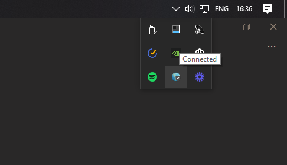

# DAQ-EXP_TA
Gumpf for TA

# LabVIEW instillation guide

Hi
Labview has been abit of 
a pain so I've put together this 
guide to go with the video I will 
do later. 
First thing that needs doing is 
smashing open a google window. I 
am using firefox here but I doubt there will 
be any issues with other browsers.
We are going to do this the long way so 
you can get to the VPN if you need to. Traditional installs would require the vpn to access the licensing page to get the serial number, but I've been naughty and put that at the end.  
If you'd rather skip the vpn part and go 
straight to 7, you can follow that through to install.
It's cool, I understand. 

## 1. So for my VPN gang, bang in "University of Manchester IT" into your search engine of choice.

## 2. Then hit the software link.

## 3. On this screen hit the software centre link.

## 4. If you don't get the welcome page as in (5), hit the home button it the top left.

## 5. On the welcome page type "Labview" and click the third suggestion "Labview: Installation"

## 6. This is where you can get the Globalprotect VPN. Some people have reported connection issues despite stable connections and I suspect this may help. If not, try to find some tasty Eduroam nearby. On the globalvpn page run through the steps as necessary. You'll need to grab DUO mobile, the 2 factor authentication app. It's used to log into the email so a lot of you might already have it. Bop in the student creds and install the vpn. 

## 6.1 When I installed the VPN, it shouted at me saying I was running processes it needed dead. Those are given an ID and can be found in the "services" section of "Task Manager" on windows. I don't own a MAC but I imagine its similar, I own linux but I can't remember how it works on there. 

## 6.2 The VPN is turned on up here, in the taskbar drop down menu. It's really nice and clear \s. Looks like a cute little globe, N'aw.

## 7. Once that's all dandy, head on back to our AI overlord google and slam in a request for "Labview 2020 student". Hit the top link.

## 7. I managed to install the 2020 version, however people have reported issues. My recommendation is to grab 2020 first, and resort to 2019 if it throws a fit. The activation code as far as I can tell works for both.

## 7.1 Choose the bit rate of your machine and hit download. 

## 8. Launch the exe that you are bestowed and give it access to permissions.

## 8. The NI package manager should boot and look like this. Here you need to select which things to install. The IT page has a few listed but they're not all on this list. In the 3 screenshots after this, I have shown all the various modules that worked for the serial code and those that didn't, don't waste time downloading those that don't work. You'll notice a lot of the options are greyed out in this screenshot, this is because I already have them installed.

## Those that worked (Apologies for the backdated versions, been using LV a while):

## 9. Once you have checked all the boxes and hit next, it will recommend a bunch of stuff to install. *I recommend* ignoring such advice and unticking. If you find you are missing something later, boot the package installer and download it then.

## 10. Wait 1.23 Decieons for the software to install. Enjoy staring at those green squares. Oscillating around and around, perpetually. I'm pretty convinced after having these squares in my peripheral vision all day that I am either their slave or have witnessed the fundamental physics of our universe. 

   

## 11. Once that's done, you'll be presented with the product activation menu. Drop down the box and select "Enter a serial number".

## 12. This is the serial number: 
# **M85X11748**
## Bang that in every box and hit the activate button next to the dropdown menu.

## 13. With the universes favour, you will be granted your wish: a fresh and shiny new Labview install to suffer on for this unit, you're welcome. I hope this helped people out and you all got it working. If you have issues, I'm keeping an eye on the discussion board to feel free to post and we can see what's what. Big Love and see you all in the labs!
